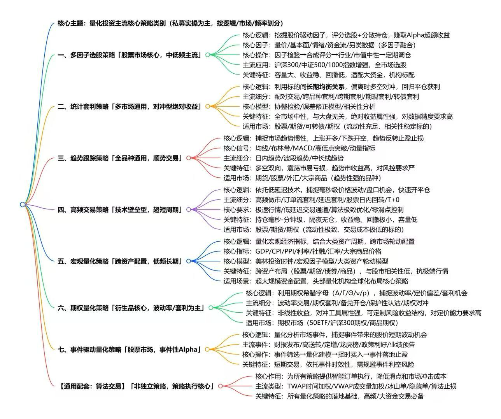

# 量化投资主流核心策略类别：归纳、说明与拓展

> 本文档基于《量化投资主流核心策略类别》思维导图（私募实操为主，按逻辑/市场/频率划分）进行归纳、说明与知识拓展，供策略研究与实盘参考。

---

## 一、文档框架说明

私募量化策略通常从三个维度划分：

| 维度 | 含义 | 典型取值 |
|------|------|----------|
| **逻辑** | 策略的收益来源与假设 | 因子驱动、统计关系、趋势惯性、事件冲击等 |
| **市场** | 交易标的与资产类别 | 股票、期货、期权、可转债、外汇、商品 |
| **频率** | 持仓与调仓周期 | 高频(毫秒~分钟)、日内、波段、中低频(周/月)、宏观(季/年) |

下图概括了七类主流策略及通用配套的执行层：

下文对每一类策略做**归纳、说明与拓展**。

---

## 二、多因子选股策略

**定位**：股票市场核心策略，中低频主流，机构标配。

### 2.1 核心逻辑

通过系统化挖掘**股价驱动因子**，对股票打分排序，**分散持仓**，以获取相对基准的**Alpha 超额收益**，并控制行业、市值等风险暴露。

### 2.2 核心因子与拓展

| 类别 | 说明 | 常见因子/拓展 |
|------|------|----------------|
| **价量** | 价格与成交行为 | 动量、反转、波动率、换手率、量价背离、Amihud 非流动性 |
| **基本面** | 财报与估值 | 估值(PE/PB/PS)、盈利(ROE/ROA)、成长(营收/利润增速)、质量(资产周转、杠杆) |
| **情绪** | 市场情绪与预期 | 分析师一致预期、盈利惊喜、投资者情绪指数、新闻情感 |
| **资金流** | 资金进出与结构 | 北向资金、融资融券、大单净流入、主力资金流 |
| **另类数据** | 非传统数据源 | 卫星/地理、供应链、招聘、专利、电商/APP 数据 |

**拓展要点**：多因子需做**有效性检验**（IC/IR、分组回测、换手与成本）、**因子合成**（等权、IC 加权、机器学习）以及**中性化**（行业、市值、风格），以控制回撤与容量衰减。

### 2.3 核心流程

1. **因子检验**：单因子 IC、分层收益、换手率、衰减周期。  
2. **合成评分**：多因子加权得到综合得分，可结合约束优化。  
3. **行业/市值中性**：控制相对基准的暴露，常用约束优化或回归剥离。  
4. **定期调仓**：按周/双周/月调仓，平衡 Alpha 与交易成本。

### 2.4 主流应用与容量

- **指数增强**：沪深 300、中证 500、中证 1000 增强，控制跟踪误差。  
- **全市场选股**：不对标单一指数，追求绝对收益或相对宽基的超额。  
- **关键特征**：容量大、收益相对稳定、回撤可控，适合大资金与机构配置。

### 2.5 风险与注意点

- 因子失效、风格暴露过大、过度拟合历史数据。  
- 需持续迭代因子与模型，并做好交易成本与冲击的估计。

---

## 三、统计套利策略

**定位**：多市场通用，对冲型，以**绝对收益**为目标。

### 3.1 核心逻辑

利用标的之间的**长期统计均衡关系**（如协整、稳定价差）。当价差/比值**偏离历史均衡**时，做多相对低估、做空相对高估，等待**均值回归**后平仓获利；通过多空对冲实现市场中性。

### 3.2 主流细分

| 类型 | 说明 | 典型标的 |
|------|------|----------|
| **配对交易** | 两只标的价差/比值的均值回归 | 同行业股票、ETF 与成分股 |
| **跨品种套利** | 相关品种间的价差回归 | 螺纹/热卷、豆粕/豆油、股指与行业 ETF |
| **跨期套利** | 同一品种不同到期合约价差 | 期货近月/远月、期权不同到期日 |
| **期现套利** | 期货与现货的基差收敛 | 股指期货与指数、商品期货与现货 |
| **转债套利** | 可转债与正股、转股价值与市价偏离 | 可转债与对应股票 |

### 3.3 核心模型与拓展

- **协整检验**：Engle-Granger、Johansen，确定是否存在长期均衡。  
- **误差修正模型(ECM)**：刻画短期偏离与向长期均衡的调整速度。  
- **相关性/协方差**：用于配对筛选与动态对冲比例。  
- **拓展**：可引入**半衰期**估计、**动态价差区间**（布林带、分位数）、止损与仓位管理。

### 3.4 关键特征与适用市场

- **关键特征**：市场中性、与指数相关性低、绝对收益属性强；对**数据精度、滑点、手续费**敏感。  
- **适用市场**：股票、期货、可转债、期权等**流动性好、历史相关性/协整关系较稳定**的标的。

### 3.5 风险与注意点

- 均衡关系结构性断裂（政策、基本面变化）。  
- 单边趋势下价差长期不回归，需止损与资金管理。  
- 流动性不足时冲击与滑点会侵蚀收益。

---

## 四、趋势跟踪策略

**定位**：全品种通用，**顺势交易**，多空双向。

### 4.1 核心逻辑

假设价格存在**趋势惯性**：上涨时做多、下跌时做空，在趋势延续中持有，在**趋势反转**时止盈或止损，不预测拐点，只跟随价格与信号。

### 4.2 核心信号与指标

- **均线类**：双均线、多均线、均线通道。  
- **通道/波动**：布林带、ATR、通道突破。  
- **动量/趋势**：MACD、动量指标、高低点突破（如 Donchian）。  
- **拓展**：可结合波动率过滤（低波动少交易）、多周期确认、自适应参数。

### 4.3 主流细分

- **日内趋势**：当日开平，不隔夜，适合期货、可 T+0 市场。  
- **波段趋势**：持仓数日至数周，捕捉中期趋势。  
- **中长线趋势**：持仓周期更长，适合大级别趋势与低换手。

### 4.4 关键特征与适用市场

- **关键特征**：多空双向；**震荡市易连续亏损**，趋势市收益潜力大；对**风控与资金管理**要求高。  
- **适用市场**：期货、股票、外汇、大宗商品等**趋势性较强、流动性充足**的品种。

### 4.5 风险与注意点

- 震荡市中的假突破与连续止损。  
- 需明确入场、出场、加仓、减仓规则，并控制单笔与总仓位。

---

## 五、高频交易策略

**定位**：技术壁垒高，**超短周期**（毫秒至分钟级）。

### 5.1 核心逻辑

依托**低延迟基础设施**（行情、报单、撮合），捕捉**毫秒级价格波动、盘口价差与订单流**信息，快速开平仓，赚取微小价差或流动性溢价，**隔夜无仓**。

### 5.2 主流细分

- **高频做市**：双边挂单，赚取买卖价差，承担库存与方向风险。  
- **订单流/信息套利**：根据订单流、大单、逐笔成交推断短期方向。  
- **延迟套利**：利用不同通道、不同市场间的信息与价格延迟。  
- **股票日内回转 / T+0**：当日多次买卖同一标的，不隔夜。

### 5.3 核心要求

- **极速行情**：直连交易所或优质数据源，低延迟。  
- **低延迟交易通道**：主机托管、直连、专用线路。  
- **算法与系统**：从信号到下单全链路优化，减少延迟与滑点。  
- **成本控制**：手续费、印花税、冲击成本需精细测算，否则易被侵蚀。

### 5.4 关键特征与适用市场

- **关键特征**：持仓时间极短，隔夜无仓；收益稳定、回撤小，但**策略容量有限**。  
- **适用市场**：股票、期货、期权等**流动性极好、交易成本低**的标的。

### 5.5 风险与注意点

- 技术故障、网络延迟、交易所规则变化。  
- 竞争激烈，同质化策略易导致利润下降；需持续投入技术与策略研发。

---

## 六、宏观量化策略

**定位**：**跨资产配置**，低频、长期视角。

### 6.1 核心逻辑

将**宏观经济指标**量化，结合**经济周期、流动性、通胀**等状态，构建**大类资产轮动**或**风险平价/配置**模型，在股票、债券、商品、外汇等之间动态配置，追求长期稳健收益与分散化。

### 6.2 核心指标

- **增长**：GDP、工业增加值、PMI、就业。  
- **通胀**：CPI、PPI、通胀预期。  
- **货币与信用**：利率、社融、M1/M2、信贷。  
- **外部**：汇率、大宗商品价格、全球风险偏好。

### 6.3 核心模型

- **美林投资时钟**：增长+通胀四象限，对应股票/债券/商品/现金的轮动。  
- **宏观因子模型**：将资产收益分解为增长、通胀、流动性等因子。  
- **大类资产轮动**：基于宏观状态或动量的资产权重优化。

### 6.4 关键特征与适用场景

- **关键特征**：跨资产布局，与单一股市相关性可做得较低，具备**抗极端行情**的潜力。  
- **适用场景**：超大规模资金、家办、头部量化机构的**全球与多资产配置**。

### 6.5 风险与注意点

- 宏观指标滞后、口径调整与数据修正。  
- 历史周期规律在未来可能失效，需结合情景分析与压力测试。

---

## 七、期权量化策略

**定位**：衍生品核心，以**波动率与套利**为主。

### 7.1 核心逻辑

利用期权的**非线性收益**与**希腊字母**（Delta、Gamma、Theta、Vega、Rho），捕捉**波动率 mispricing**、**波动率曲面**偏差、**标的与波动率**的联合机会，或用于**对冲与风险定制**。

### 7.2 主流细分

- **波动率交易**：做多/做空隐含波动率（如跨式、宽跨式、方差互换）。  
- **期权套利**：Put-Call 平价、箱体、日历价差、蝶式等。  
- **备兑开仓**：持有标的并卖出虚值认购，增强收益。  
- **保护性认沽**：持有标的并买入认沽，对冲下行。  
- **期权对冲**：用期权对 Delta、Gamma、Vega 等进行中性化或定向暴露。

### 7.3 关键特征与适用市场

- **关键特征**：收益非线性，可定制风险收益；对**定价与风控**要求高。  
- **适用市场**：50ETF 期权、沪深 300 期权、商品期权等**流动性足够的期权市场**。

### 7.4 风险与注意点

- 流动性、买卖价差、保证金与强平风险。  
- 需熟练掌握 Greeks 与波动率曲面，并做好压力测试。

---

## 八、事件驱动量化策略

**定位**：股票市场，**事件性 Alpha**，偏短期。

### 8.1 核心逻辑

对**可识别的公司/市场事件**进行量化定义与筛选，建立事件与股价反应的统计关系，在事件前后**择时建仓**，在事件落地或预期兑现后**止盈**，赚取事件带来的短期定价偏差。

### 8.2 主流事件类型

- **财报**：业绩快报、年报/季报、业绩预告、业绩说明会。  
- **公司行为**：高送转、定增、回购、分红、股权激励。  
- **交易与资金**：龙虎榜、大宗交易、举牌、增减持。  
- **政策与行业**：产业政策、行业规划、监管表态。  
- **其他**：业绩预告上修/下修、分析师上调/下调。

### 8.3 核心流程

1. **事件筛选**：定义事件类型、时间窗口、样本池。  
2. **量化建模**：事件前后收益分布、超额收益、胜率、持仓周期。  
3. **择时与建仓**：根据模型信号与风控规则入场。  
4. **事件落地止盈**：事件公告或预期兑现后减仓/平仓。

### 8.4 关键特征与风险

- **关键特征**：交易周期短，依赖**事件时效性与数据质量**。  
- **风险**：事件利空、预期已充分定价、流动性不足、数据延迟或错误。

---

## 九、通用配套：算法交易

**定位**：**非独立策略**，而是所有策略的**执行层核心**。

### 9.1 核心作用

在给定目标（成交量、价格、时间等）下，通过**智能拆单与下单**，减少**滑点**与**市场冲击成本**，在合规与风控约束下完成交易。

### 9.2 主流类型

| 类型 | 说明 | 典型场景 |
|------|------|----------|
| **TWAP** | 时间加权平均价格，在时间上均匀分布订单 | 大单拆单、减少时间集中冲击 |
| **VWAP** | 成交量加权平均价格，跟随历史或预期成交量分布 | 跟踪日内成交量曲线 |
| **冰山单/隐藏单** | 仅展示部分订单量，减少信息泄露与冲击 | 大单、流动性一般标的 |
| **算法止损** | 条件触发后按预定算法卖出 | 风控、止损执行 |

### 9.3 拓展

- **Implementation Shortfall**：以执行价相对决策价的偏差最小化为目标。  
- **POV (Percentage of Volume)**：按市场实时成交量的一定比例参与。  
- **组合单**：多标的联合执行与约束（资金、风险、行业暴露等）。

### 9.4 关键特征

- 所有量化策略的**落地基础**；高频与大资金尤其依赖算法交易。  
- 需与经纪商、交易所接口、风控系统配合，并持续评估执行质量（如 TCA）。

---

## 十、策略分类小结与使用建议

| 策略类别     | 逻辑/市场/频率概要        | 收益属性     | 容量与门槛 |
|--------------|----------------------------|--------------|------------|
| 多因子选股   | 股票/中低频/因子驱动      | 相对收益为主 | 大/中高    |
| 统计套利     | 多市场/中低频/均值回归    | 绝对收益     | 中/中高    |
| 趋势跟踪     | 全品种/日内~中长/顺势     | 方向性       | 中~大/中   |
| 高频交易     | 股期权/超短/微观结构      | 绝对收益     | 小/极高    |
| 宏观量化     | 跨资产/低频/周期与配置    | 绝对+分散    | 大/高      |
| 期权量化     | 期权/多频率/波动率与套利  | 绝对/对冲    | 中/高      |
| 事件驱动     | 股票/短期/事件性 Alpha    | 绝对/相对    | 中/中高    |
| 算法交易     | 执行层/全策略配套         | 降低成本     | —          |

**使用建议**：  
- 按**资金规模、风险偏好、技术能力**选择主策略与辅助策略。  
- 多策略、多频率、多资产组合可改善夏普与回撤。  
- 无论哪类策略，都需重视**回测与实盘差异**、**成本与冲击**、**风控与合规**。

---

## 十一、延伸阅读与参考方向

- **多因子**：Fama-French 因子、Barra 风险模型、因子中性与组合优化。  
- **统计套利**：协整与 ECM、配对交易半衰期、价差分布与止损。  
- **趋势**：海龟法则、均线/通道系统、多周期与波动率过滤。  
- **高频**：订单簿建模、做市与库存风险、延迟与 co-location。  
- **宏观**：美林时钟、宏观因子、风险平价与目标风险。  
- **期权**：Black-Scholes、隐含波动率与曲面、Greeks 与对冲。  
- **事件**：事件研究法、公告效应、日历异常。  
- **执行**：TWAP/VWAP、Implementation Shortfall、TCA。

---

*文档版本：v1.0 | 基于思维导图归纳与拓展，供学习与策略研究使用。*
